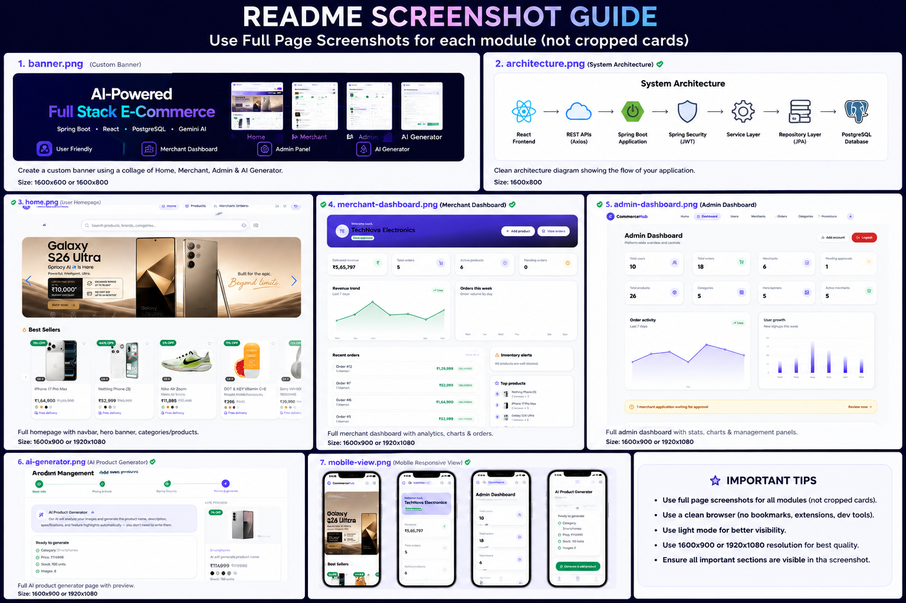
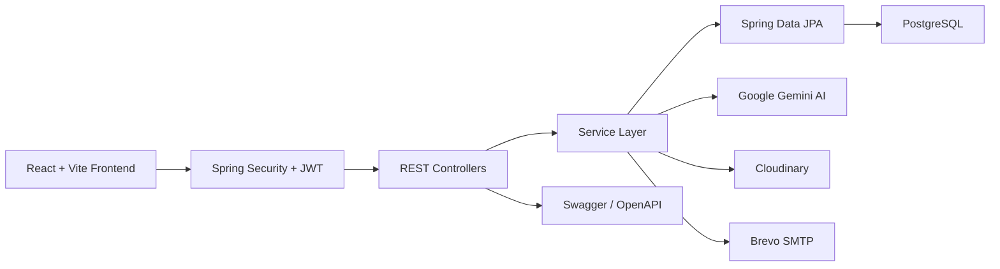

<div align="center">

# CommerceHub

### AI-Powered Full Stack Multi-Role E-Commerce Platform

Production-inspired e-commerce platform built with **Spring Boot**, **React**, **PostgreSQL**, and **Google Gemini AI**, featuring secure authentication, AI-assisted product management, responsive dashboards, and cloud deployment.



<br>


</div>

---

# Overview

CommerceHub is a production-inspired AI-powered multi-role e-commerce platform built to simulate a real-world online marketplace.

The platform enables customers to shop seamlessly, merchants to manage products with AI assistance, and administrators to monitor the entire marketplace through dedicated dashboards.

Key capabilities include secure JWT authentication, Google OAuth2 login, AI-powered product generation using Google Gemini, Cloudinary image management, Email OTP verification, responsive UI, and scalable REST APIs.

---

# Live Demo

| Service | URL |
|---------|-----|
| Frontend | https://springboot-react-ecommerce-project-alpha.vercel.app |
| Backend API | https://ecommerce-backend-o9vh.onrender.com |
| Swagger | https://ecommerce-backend-o9vh.onrender.com/swagger-ui/index.html#/ |
| Health Check | https://ecommerce-backend-o9vh.onrender.com/actuator/health |

---

# System Architecture

CommerceHub follows a **Layered Monolithic Architecture** with a clear separation of concerns. The React frontend communicates with a secure Spring Boot REST API protected by Spring Security and JWT authentication. Business logic is organized into controllers, services, and repositories, while external services such as **Google Gemini AI**, **Cloudinary**, and **Brevo SMTP** are integrated to provide AI-powered content generation, cloud image storage, and email notifications.


---

# Features

## User

- JWT Authentication & Google OAuth2
- Email OTP Verification
- Product Search & Smart Filters
- Product Details & Reviews
- Shopping Cart & Checkout
- Order Management
- Profile Management
- Responsive User Interface

---

## Merchant

- Analytics Dashboard
- AI Product Generation
- Product Management
- Inventory Management
- Image Upload (Cloudinary)
- Order Management
- Sales Analytics
- Merchant Profile & Settings

---

## Administrator

- Dashboard Analytics
- User Management
- Merchant Approval
- Category Management
- Order Monitoring
- Platform Administration

---

# AI Integration

Google Gemini AI automates product creation by generating high-quality product content directly from uploaded images.

### AI Features

- Product Recognition
- Product Description Generation
- Feature Highlights
- Technical Specifications
- SEO Keywords
- AI-Assisted Product Creation

### AI Workflow

```text
Product Images
      │
      ▼
Google Gemini AI
      │
      ▼
Product Recognition
      │
      ▼
AI Content Generation
      │
      ▼
Description • Specifications • Highlights • SEO
      │
      ▼
Saved to Database
```

---

# Technology Stack

| Layer | Technologies |
|--------|--------------|
| Frontend | React, Vite, Tailwind CSS, Axios |
| Backend | Java 21, Spring Boot, Spring Security, Spring Data JPA, Hibernate |
| Database | PostgreSQL (Neon) |
| Authentication | JWT, Google OAuth2 |
| AI | Google Gemini API |
| Cloud Services | Cloudinary, Brevo SMTP |
| Documentation | Swagger / OpenAPI |
| DevOps | Maven, Docker |
| Deployment | Vercel, Render |

---

# Project Structure

```text
springboot-react-ecommerce-project
│
├── backend/
│   ├── README.md
│   └── assets/
│
├── frontend/
│   ├── README.md
│   └── assets/
│
└── README.md
```

---

# Documentation

| Module | Description |
|--------|-------------|
| backend/README.md | Backend architecture, APIs, Security, Database, AI Integration, Deployment |
| frontend/README.md | React architecture, Components, Routing, State Management, Responsive UI |

---

# Core Features

| Feature | Status |
|---------|:------:|
| JWT Authentication | ✅ |
| Google OAuth2 | ✅ |
| Email OTP Verification | ✅ |
| Multi-Role Access | ✅ |
| AI Product Generation | ✅ |
| Merchant Dashboard | ✅ |
| Admin Dashboard | ✅ |
| Product Management | ✅ |
| Shopping Cart | ✅ |
| Orders & Reviews | ✅ |
| Search & Filters | ✅ |
| Pagination | ✅ |
| Cloudinary Integration | ✅ |
| Responsive Design | ✅ |
| Swagger Documentation | ✅ |

---

# Project Summary

- Full Stack Architecture
- Multi-Role Platform
- RESTful APIs
- AI-Powered Product Generation
- Secure Authentication
- Cloud-Based Deployment
- Responsive User Experience
- Production-Inspired Design

---

# Quick Start

```bash
git clone https://github.com/PRAHLAD09-dev/springboot-react-ecommerce-project.git
cd springboot-react-ecommerce-project
```

| Module | Documentation |
|--------|---------------|
| Backend | `backend/README.md` |
| Frontend | `frontend/README.md` |

Run the frontend locally:

```bash
cd frontend
npm install
npm run dev
```

Default URL: **http://localhost:5173**

---

# Deployment

| Frontend | Backend | Database | Images | Email | AI |
|----------|---------|----------|--------|-------|----|
| Vercel | Render | Neon PostgreSQL | Cloudinary | Brevo | Google Gemini |

---

# Security

JWT Authentication • Google OAuth2 • Role-Based Authorization • BCrypt Password Encryption • Email OTP Verification • Protected REST APIs • CORS Configuration

---

# Roadmap

Payment Gateway • Wishlist • PWA • Live Chat • Sales Analytics • Merchant Reports • Coupon System • Dark Mode • Multi-Language Support

---

# Developer

**Prahlad Bhakat**

Java Backend & Full Stack Developer

GitHub: https://github.com/PRAHLAD09-dev

LinkedIn: https://www.linkedin.com/in/prahlad-bhakat/

Email: prahladbhakat05@gmail.com

---

<div align="center">

**If you found this project helpful, consider giving it a ⭐**

Built with **Java • Spring Boot • React • PostgreSQL • Google Gemini AI**

</div>