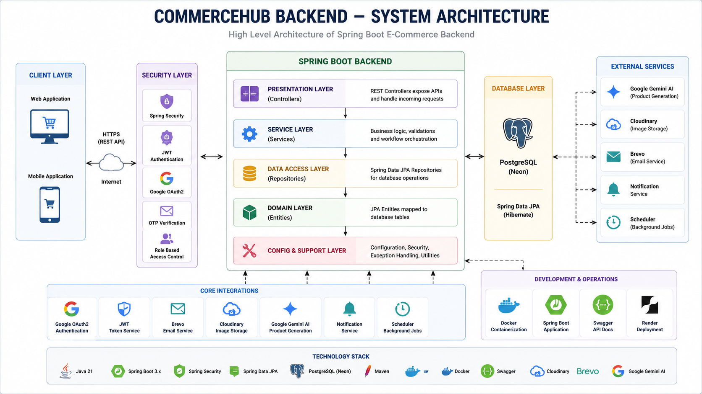
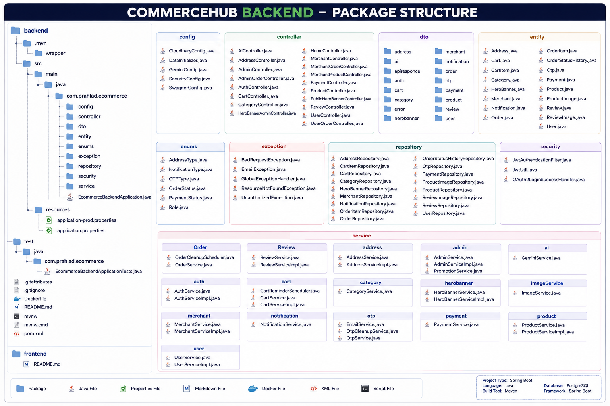
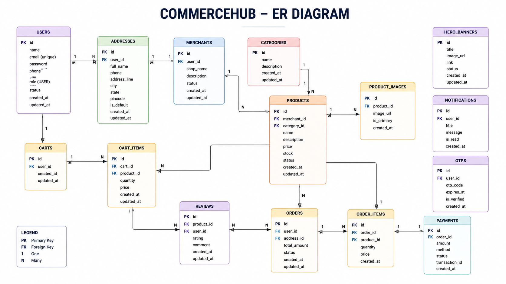
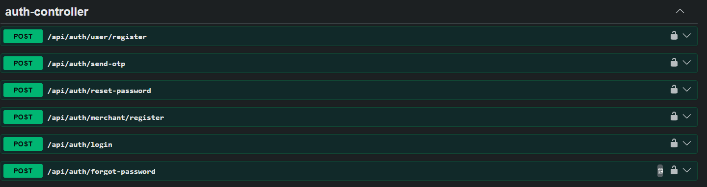
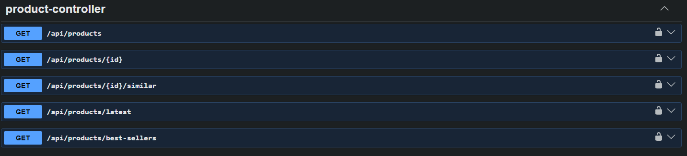
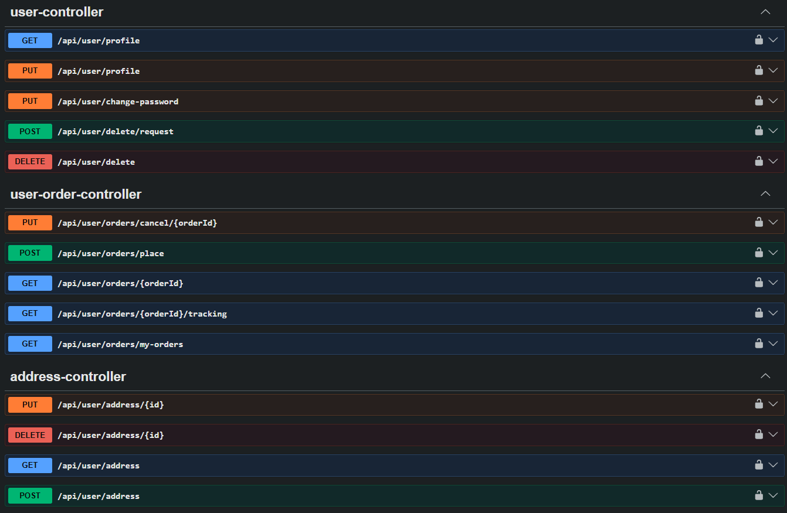
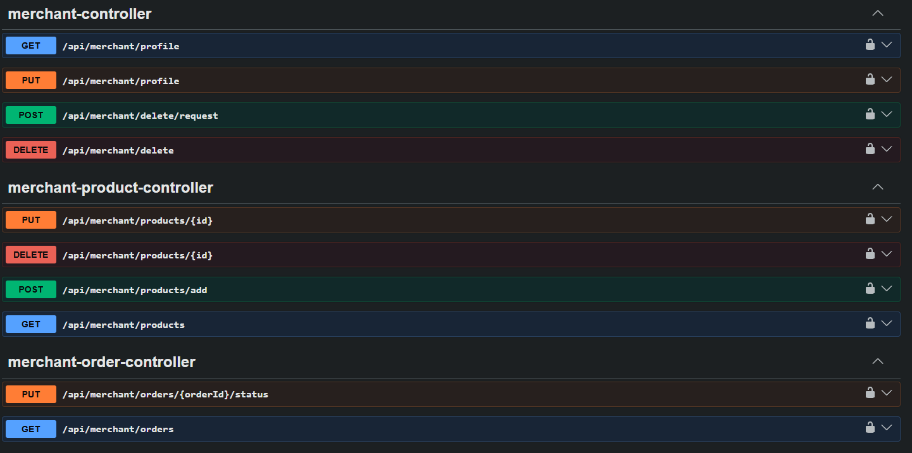
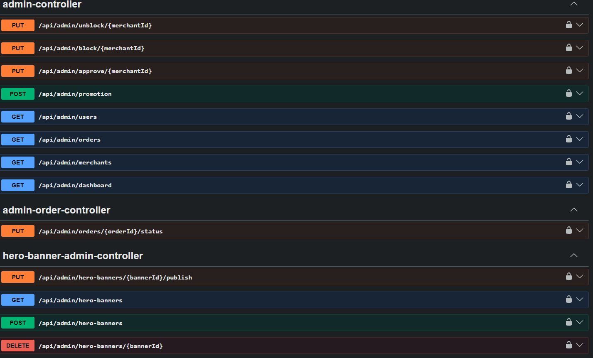

<div align="center">

# 🚀 CommerceHub Backend

### AI-Powered Spring Boot REST API for a Multi-Role E-Commerce Platform

A production-inspired backend built with **Spring Boot**, **Spring Security**, **JWT Authentication**, **Google OAuth2**, **Google Gemini AI**, **Cloudinary**, **Brevo**, and **PostgreSQL (Neon)**.

<p align="center">


</p>

</div>

---

# 📖 Overview

CommerceHub Backend is a modern **Spring Boot REST API** that powers a complete multi-role e-commerce platform. The application follows a clean layered architecture and integrates secure authentication, AI-powered product generation, cloud storage, and production-ready backend practices.

The system supports three major roles:

- 👤 User
- 🛍 Merchant
- 👨‍💼 Admin

All business operations are exposed through secure REST APIs designed for seamless integration with modern frontend frameworks such as React.

---

# ✨ Key Features

## 🔐 Authentication

- JWT Authentication
- Google OAuth2 Login
- Email OTP Verification
- Password Encryption
- Role-Based Authorization

## 🛒 E-Commerce

- Product Management
- Category Management
- Shopping Cart
- Order Management
- Review & Rating System
- Address Management
- Payment Module

## 🤖 AI & Cloud

- AI Product Generation (Google Gemini)
- Cloudinary Image Storage
- Brevo Email Service
- Hero Banner Management
- Notification System

## ⚙ Developer Features

- Swagger Documentation
- Docker Support
- RESTful APIs
- DTO-Based Architecture
- Global Exception Handling
- Pagination, Sorting & Filtering

---

# 🛠 Tech Stack

| Category | Technology |
|----------|------------|
| Language | Java 21 |
| Framework | Spring Boot |
| Security | Spring Security, JWT, OAuth2 |
| ORM | Spring Data JPA, Hibernate |
| Database | PostgreSQL (Neon) |
| AI | Google Gemini |
| Image Storage | Cloudinary |
| Email | Brevo |
| Documentation | Swagger / OpenAPI |
| Build Tool | Maven |
| Deployment | Render |
| Container | Docker |

---

## ScreenShots

## 🏗 System Architecture



---

## 📦 Package Structure



---

## 🗄 Entity Relationship Diagram



---

## 📸 Swagger API Documentation

## 📸 Swagger API Documentation

### Authentication APIs



---

### Product APIs



---

### Merchant APIs



---

### Merchant APIs



---

### Admin APIs



# 🏗 High-Level Architecture

```text
                 React Frontend
                        │
                        ▼
              Spring Boot REST APIs
                        │
        ┌───────────────┼────────────────┐
        ▼               ▼                ▼
 Spring Security     Business Layer   Swagger
        │               │
        ▼               ▼
      JWT Auth      Spring Data JPA
                        │
                        ▼
               PostgreSQL (Neon)
                        │
      ┌─────────────────┼────────────────┐
      ▼                 ▼                ▼
 Google Gemini      Cloudinary       Brevo
     AI          Image Storage    Email Service
```

---

# 🎯 Project Goals

This project was built to:

- Develop a production-inspired backend
- Practice scalable Spring Boot architecture
- Implement secure authentication & authorization
- Integrate AI into an e-commerce workflow
- Follow clean code and layered architecture
- Demonstrate enterprise backend development skills

---

# 🏗 Project Structure & Backend Architecture

CommerceHub Backend follows a layered architecture that separates presentation, business logic, persistence, and configuration into independent modules. This structure improves maintainability, scalability, and code readability.

---

# 📂 Project Structure

```text
backend
├── src
│   ├── main
│   │   ├── java
│   │   │   └── com.prahlad.ecommerce
│   │   │       ├── config
│   │   │       ├── controller
│   │   │       ├── dto
│   │   │       ├── entity
│   │   │       ├── enums
│   │   │       ├── exception
│   │   │       ├── repository
│   │   │       ├── security
│   │   │       ├── service
│   │   │       └── EcommerceBackendApplication.java
│   │   └── resources
│   │       ├── application.properties
│   │       └── application-prod.properties
│   └── test
├── Dockerfile
├── pom.xml
└── README.md
```

---

# 📦 Package Overview

| Package | Responsibility |
|----------|----------------|
| config | Framework & third-party configuration |
| controller | REST API endpoints |
| dto | Request & Response models |
| entity | JPA entities mapped to database tables |
| repository | Database access layer |
| service | Business logic |
| security | Authentication & authorization |
| exception | Global exception handling |
| enums | Application constants & enums |

---

# ⚙ Configuration Layer

The **config** package centralizes all framework configuration.

Current configuration classes include:

- SecurityConfig
- SwaggerConfig
- CloudinaryConfig
- GeminiConfig
- DataInitializer

Keeping configuration isolated makes the project easier to maintain and extend.

---

# 🌐 Controller Layer

Controllers expose REST endpoints and receive HTTP requests from the frontend.

Responsibilities include:

- Request Mapping
- Input Validation
- Calling Services
- Returning API Responses

Controllers contain minimal logic and delegate processing to the service layer.

---

# ⚙ Service Layer

The service layer contains all business rules and application workflows.

Examples include:

- User Registration
- Product Management
- Cart Operations
- Order Processing
- Payment Processing
- AI Product Generation

Services coordinate repositories and external integrations while keeping controllers lightweight.

---

# 🗄 Repository Layer

Repositories provide database access using Spring Data JPA.

Responsibilities:

- CRUD Operations
- Pagination
- Filtering
- Sorting
- Custom Queries

Repositories do not contain business logic.

---

# 📦 DTO Layer

DTOs (Data Transfer Objects) separate API contracts from database entities.

Benefits:

- Prevent exposing internal entities
- Smaller response payloads
- Stable API contracts
- Easier frontend integration

Separate request and response DTOs are maintained for each major module.

---

# 🏛 Entity Layer

Entities represent the application's domain model and are mapped to PostgreSQL tables using JPA.

Core entities include:

- User
- Merchant
- Product
- Category
- Cart
- Order
- Payment
- Review
- HeroBanner
- Address
- Notification
- OTP

These entities form the foundation of the e-commerce platform.

---

# 🔄 Request Lifecycle

Every request follows the same processing pipeline.

```text
Client
  │
  ▼
REST Controller
  │
  ▼
Service Layer
  │
  ▼
Repository
  │
  ▼
PostgreSQL
  │
  ▼
Response DTO
  │
  ▼
JSON Response
```

This layered approach keeps responsibilities well-defined and simplifies testing, debugging, and future enhancements.

---

# 📐 Architecture Principles

CommerceHub Backend is designed around the following principles:

- Separation of Concerns
- Layered Architecture
- Modular Design
- Reusable Components
- Clean Code Practices
- RESTful API Design
- Dependency Injection
- Loose Coupling

These principles ensure the application remains scalable and maintainable as new features are introduced.

---
# 🔐 Security & Intelligent Services

CommerceHub Backend implements a secure authentication system combined with cloud-based integrations to provide a modern e-commerce experience. Security, authentication, AI processing, image management, and background services are designed as independent modules, making the application modular and easy to extend.

---

# 🛡 Authentication & Authorization

The backend uses **Spring Security** with **JWT Authentication** to secure protected APIs.

### Authentication Features

* User Registration
* User Login
* JWT Token Generation
* Password Encryption (BCrypt)
* Protected REST APIs
* Stateless Authentication

After a successful login, a JWT token is generated and must be included in every protected request.

```text
Authorization: Bearer <JWT_TOKEN>
```

This approach removes the need for server-side sessions and improves scalability.

---

# 👥 Role-Based Access Control

The application supports three independent roles.

| Role     | Responsibilities                |
| -------- | ------------------------------- |
| User     | Shopping, Cart, Orders, Reviews |
| Merchant | Product & Inventory Management  |
| Admin    | Platform Administration         |

Spring Security validates every request before allowing access to protected resources.

---

# 🌐 Google OAuth2 Login

In addition to traditional authentication, users can sign in using their Google account.

OAuth2 integration provides:

* Faster Login
* Secure Authentication
* Automatic User Registration
* JWT Generation After Login

This reduces manual registration while improving the overall user experience.

---

# 📧 Email OTP Verification

OTP verification is used for sensitive operations such as account verification and password reset.

Workflow:

```text
User Action
      │
      ▼
Generate OTP
      │
      ▼
Send Email (Brevo)
      │
      ▼
User Verification
```

Expired OTP records are automatically cleaned by scheduled background tasks.

---

# 🤖 AI Product Generation

One of the key features of CommerceHub is AI-assisted product creation.

Instead of manually writing descriptions and specifications, merchants upload product images, and **Google Gemini AI** generates structured product information.

Generated data includes:

* Product Description
* Feature Highlights
* Specifications
* Product Identification
* SEO-Friendly Metadata

This significantly reduces manual effort while improving product consistency.

---

# ☁ Cloudinary Image Storage

Product images are stored securely on **Cloudinary**.

Benefits include:

* Cloud Storage
* CDN Delivery
* Optimized Images
* Secure URLs
* Multiple Product Images

Only image URLs are stored in the database, reducing storage requirements on the backend server.

---

# 🔔 Notification Module

The notification system provides a centralized mechanism for platform communication.

Supported notification types include:

* Promotional Messages
* Merchant Notifications
* User Notifications
* Order Updates

The module is designed to support future integrations such as push notifications and SMS.

---

# ⏰ Background Scheduler Services

Several scheduled services run automatically in the background to improve system maintenance.

Current schedulers include:

* Cart Reminder Scheduler
* OTP Cleanup Scheduler
* Order Cleanup Scheduler

These background jobs automate repetitive tasks and keep the application optimized without manual intervention.

---

# 🌍 External Service Integrations

| Service         | Purpose               |
| --------------- | --------------------- |
| Google Gemini   | AI Product Generation |
| Cloudinary      | Image Storage         |
| Brevo           | Email Delivery        |
| Neon PostgreSQL | Cloud Database        |
| Render          | Application Hosting   |

Each service is integrated through a dedicated configuration and service layer, keeping the application loosely coupled and easy to maintain.

---

# ✅ Security & Integration Highlights

CommerceHub Backend provides:

* JWT Authentication
* Role-Based Authorization
* Google OAuth2 Login
* Email OTP Verification
* AI-Assisted Product Generation
* Cloud Image Management
* Background Scheduler Services
* Modular External Integrations

These features collectively provide a secure, intelligent, and scalable backend foundation for the e-commerce platform.

---

# 🗄 Database Design & API Standards

CommerceHub Backend uses **PostgreSQL** with **Spring Data JPA (Hibernate)** to manage application data. The persistence layer is designed around domain-driven entities, while the REST APIs expose clean and consistent data contracts using DTOs.

---

# 🏛 Database Design

The application stores data in a relational database where each business module is represented by dedicated entities.

### Core Domain Models

* User
* Merchant
* Product
* Category
* Cart
* CartItem
* Order
* OrderItem
* Payment
* Review
* ReviewImage
* ProductImage
* Address
* HeroBanner
* Notification
* OTP

This modular structure keeps business data organized and simplifies future feature expansion.

---

# 🔗 Entity Relationships

The entities are connected using JPA relationships to maintain data consistency.

```text
Merchant
    │
    └──────────► Products ◄────────── Category
                     │
          ┌──────────┴──────────┐
          ▼                     ▼
   Product Images          Reviews
                                 │
                                 ▼
                               User

User
 ├── Addresses
 ├── Cart
 ├── Orders
 └── Reviews

Order
 ├── Order Items
 └── Payment
```

These relationships reduce data duplication while preserving referential integrity.

---

# 📚 Repository Layer

Each entity is managed through its own Spring Data JPA repository.

Responsibilities include:

* CRUD Operations
* Entity Lookup
* Pagination
* Filtering
* Sorting
* Custom Queries

The repository layer remains focused on persistence only, while business rules are handled by the service layer.

---

# 🌐 REST API Design

The backend follows RESTful principles with resource-based endpoints and predictable HTTP methods.

Example endpoint structure:

```text
/api/auth
/api/products
/api/categories
/api/cart
/api/orders
/api/reviews
/api/users
/api/merchant
/api/admin
```

This organization keeps APIs intuitive and easy to consume.

---

# 📄 Standard API Response

All APIs return a consistent JSON response structure.

Success response:

```json
{
  "success": true,
  "message": "Operation completed successfully",
  "data": {}
}
```

Error response:

```json
{
  "success": false,
  "message": "Validation failed",
  "errors": {}
}
```

A unified response format simplifies frontend integration and improves maintainability.

---

# 🔍 Pagination, Filtering & Sorting

The product module supports efficient browsing through database-level operations.

Available capabilities:

* Pagination
* Keyword Search
* Category Filtering
* Price Range Filtering
* Sorting by Name
* Sorting by Price
* Latest Products
* Best Sellers

These features improve performance by returning only the required data.

---

# 📨 Request & Response Models

The backend uses dedicated DTOs for communication between the client and server.

### Request DTOs

Handle incoming client data such as:

* Authentication
* Product Creation
* Address Management
* Reviews
* Orders

### Response DTOs

Return only the fields required by the frontend, avoiding direct exposure of database entities.

This approach keeps APIs stable even if internal database models change.

---

# 📘 Swagger Documentation

All endpoints are documented using **Swagger / OpenAPI**.

Developers can:

* Explore available APIs
* Test endpoints interactively
* Inspect request models
* View response schemas
* Authenticate protected APIs

Typical local URL:

```text
http://localhost:8080/swagger-ui/index.html
```

Swagger significantly reduces integration time for frontend and third-party developers.


---

# ✅ Data Layer Highlights

CommerceHub Backend provides:

* Relational Database Design
* Clean Entity Relationships
* Spring Data JPA Repositories
* RESTful API Standards
* Consistent JSON Responses
* DTO-Based Communication
* Efficient Pagination
* Flexible Filtering & Sorting
* Interactive API Documentation

These practices ensure reliable data management while delivering a clean and developer-friendly API experience.

---

# 🚀 Local Setup & Deployment

## Prerequisites

Before running the backend, make sure the following tools are installed:

* Java 21
* Maven
* PostgreSQL (or Neon Database)
* Git
* Docker *(Optional)*

---

## Environment Variables

Configure the following environment variables before starting the application.

```properties
DATABASE_URL=
DATABASE_USERNAME=
DATABASE_PASSWORD=

JWT_SECRET=

GEMINI_API_KEY=

CLOUDINARY_CLOUD_NAME=
CLOUDINARY_API_KEY=
CLOUDINARY_API_SECRET=

BREVO_API_KEY=

GOOGLE_CLIENT_ID=
GOOGLE_CLIENT_SECRET=
```

---

## Run Locally

Clone the repository

```bash
git clone https://github.com/PRAHLAD09-dev/springboot-react-ecommerce-project.git
```

Move to backend

```bash
cd backend
```

Install dependencies

```bash
mvn clean install
```

Run the application

```bash
mvn spring-boot:run
```

Application will start at

```text
http://localhost:8080
```

Swagger Documentation

```text
http://localhost:8080/swagger-ui/index.html
```

---

# 🐳 Docker

Build Image

```bash
docker build -t commercehub-backend .
```

Run Container

```bash
docker run -p 8080:8080 commercehub-backend
```

---

# ☁ Deployment

The backend is cloud-ready and currently uses:

| Service         | Platform        |
| --------------- | --------------- |
| Backend Hosting | Render          |
| Database        | Neon PostgreSQL |
| Image Storage   | Cloudinary      |
| AI              | Google Gemini   |
| Email Service   | Brevo           |

---

# 📈 Future Roadmap

Planned enhancements include:

* Payment Gateway Integration
* Wishlist Module
* Redis Caching
* Elasticsearch
* WebSocket Notifications
* AI Product Recommendations
* Microservices Architecture
* Kubernetes Deployment

---

# 🤝 Contributing

Contributions are welcome.

1. Fork the repository.
2. Create a feature branch.
3. Commit your changes.
4. Open a Pull Request.

Please follow the existing project structure and coding conventions.

---

# 👨‍💻 Author

**Prahlad Bhakat**

Backend Developer

* Java
* Spring Boot
* PostgreSQL
* React

GitHub

```text
https://github.com/PRAHLAD09-dev
```

---

# 📜 License

This project is intended for **learning, portfolio, and educational purposes**.

Feel free to explore the codebase, learn from the implementation, and use it as a reference for your own projects.

---

<div align="center">

## ⭐ If you like this project, don't forget to give it a Star ⭐

**Built with ❤️ using Java, Spring Boot, PostgreSQL, Google Gemini AI, Cloudinary & Docker**

</div>

