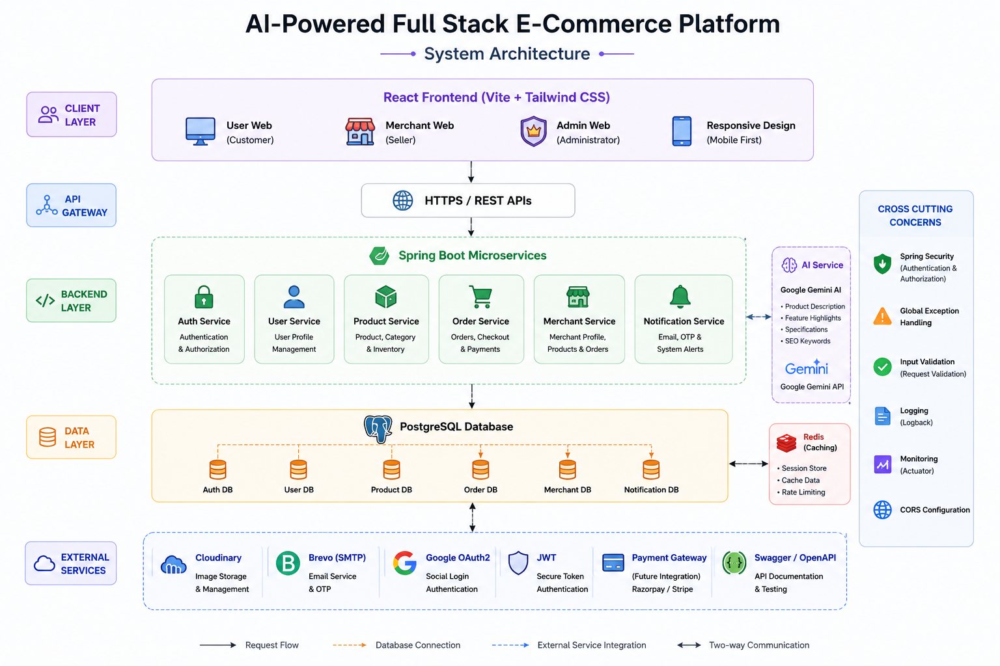
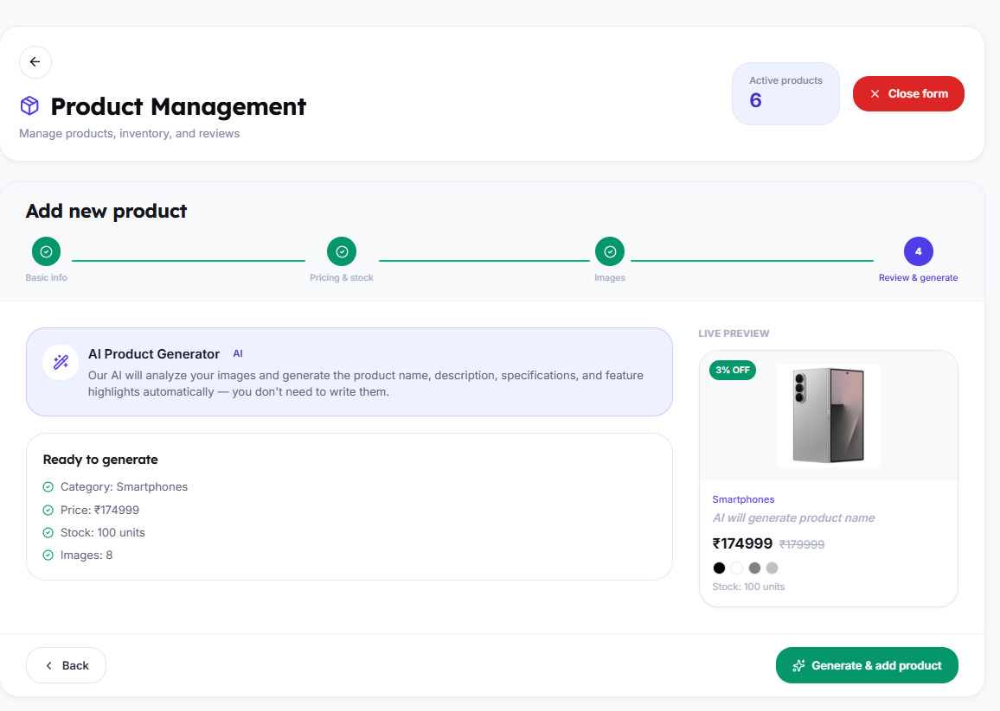
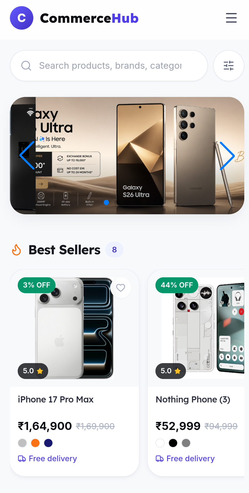

<div align="center">

# 🛒 AI-Powered Full Stack E-Commerce Platform

### Production-Inspired Multi-Role E-Commerce Application Built with Spring Boot, React & AI

A modern full stack e-commerce platform featuring **AI-powered product generation, secure authentication, role-based access control, responsive UI, and production-ready architecture.**

<p align="center">

</p>

<p align="center">


</p>

<p align="center">


</p>

</div>

---

## 🌐 Live Demo

| Platform | Link |
|----------|------|
| 🚀 Frontend | https://springboot-react-ecommerce-project-alpha.vercel.app |
| ⚙ Backend API | https://springboot-react-ecommerce-project.onrender.com |
| 📘 Swagger | *(Add Backend Swagger URL)* |

---

## 📂 GitHub Repository

https://github.com/PRAHLAD09-dev/springboot-react-ecommerce-project

---

# 📖 Overview

This project is a **production-inspired AI-powered full stack e-commerce platform** that simulates the architecture of modern online marketplaces.

Instead of focusing only on CRUD operations, it demonstrates secure authentication, AI integration, responsive UI, cloud-based media management, reusable components, scalable architecture, and real-world development practices.

The application supports three different roles:

- 👤 Customer
- 🛍 Merchant
- 👑 Administrator

Each role has its own dashboard, permissions, and workflow.

---

# ✨ Highlights

- 🤖 Google Gemini AI Integration
- 🔐 JWT Authentication + Google OAuth2
- 👥 Multi-Role Architecture
- ☁ Cloudinary Image Management
- 📧 Email OTP Verification
- 📱 Fully Responsive UI
- 🎨 Modern Design System
- ⚡ Smooth Animations
- 📄 Swagger API Documentation
- 🐳 Docker Ready
- 🚀 Production-Inspired Codebase

---

# 🚀 Core Features

### 👤 User

- Authentication
- Smart Product Search
- Filters & Pagination
- Shopping Cart
- Checkout
- Orders
- Notifications
- Profile Management

### 🛍 Merchant

- Analytics Dashboard
- Product Management
- AI Product Generator
- Multi-Step Product Wizard
- Order Management
- Business Profile

### 👑 Admin

- Dashboard Analytics
- Merchant Approval
- User Management
- Category Management
- Hero Banner Management
- Platform Monitoring

---

# 🛠 Technology Stack

| Category | Technologies |
|----------|--------------|
| Frontend | React 19, Vite, Tailwind CSS, Axios |
| Backend | Java 21, Spring Boot 3, Spring Security |
| Database | PostgreSQL, Hibernate, Spring Data JPA |
| Authentication | JWT, Google OAuth2 |
| AI | Google Gemini AI |
| Cloud | Cloudinary, Brevo SMTP |
| Tools | Docker, Maven, GitHub, Postman |
| Deployment | Vercel, Render |

---

# 🏗 System Architecture

<p align="center">

</p>

```text
React Frontend
       │
 REST APIs (Axios)
       │
Spring Security
       │
 JWT Authentication
       │
 REST Controllers
       │
 Service Layer
       │
 Repository Layer
       │
 PostgreSQL Database
```

---

# 📂 Project Structure

```text
springboot-react-ecommerce-project
│
├── backend
│   ├── config
│   ├── controller
│   ├── dto
│   ├── entity
│   ├── repository
│   ├── security
│   ├── service
│   └── util
│
├── frontend
│   ├── components
│   ├── layouts
│   ├── pages
│   ├── context
│   ├── services
│   ├── hooks
│   ├── utils
│   └── assets
│
└── README.md
```

---

# 🎯 Design Principles

- Layered Architecture
- Clean Code
- Reusable Components
- DTO-Based Communication
- Role-Based Authorization
- Mobile-First Responsive Design
- Accessibility Focused
- Performance Optimized
- Scalable Folder Structure
- Production-Ready Development Practices

> 📌 The project is designed to replicate a real-world e-commerce platform by combining secure backend architecture, modern frontend engineering, AI-powered features, and responsive user experience.

---

# 🚀 Features

## 👤 User Module

- JWT Authentication & Google OAuth2 Login
- Email OTP Verification
- Forgot / Reset Password
- Hero Carousel
- Smart Product Search
- Search Suggestions
- Category Filters
- Product Sorting & Pagination
- Product Gallery & Image Zoom
- AI Generated Product Information
- Shopping Cart & Checkout
- Order Tracking
- Notifications
- Profile & Address Management
- Fully Responsive Experience

<p align="center">

</p>

---

## 🛍 Merchant Module

Designed as a production-inspired seller dashboard.

### Includes

- Analytics Dashboard
- Revenue & Sales Charts
- Product Management
- Multi-Step Product Wizard
- AI Product Generator
- Drag & Drop Image Upload
- Product Preview
- Bulk Product Actions
- Order Management
- Merchant Profile
- Store Settings
- Responsive Dashboard

<p align="center">

</p>

---

## 👑 Admin Module

Complete platform management dashboard.

### Includes

- Dashboard Analytics
- User Management
- Merchant Approval
- Order Management
- Category Management
- Hero Banner Management
- Charts & Statistics
- Search & Filters
- Pagination
- Responsive Admin Panel

<p align="center">

</p>

---

# 🤖 AI Features

Google Gemini AI is integrated to generate high-quality product content.

- AI Product Description
- AI Feature Highlights
- AI Product Specifications
- AI SEO Keywords
- ChatGPT-style AI Generator Interface
- One-click Content Generation
- Regenerate & Copy Support

<p align="center">

</p>

---

# 🔒 Security Features

- Spring Security
- JWT Authentication
- Google OAuth2 Login
- Role-Based Authorization
- Password Encryption (BCrypt)
- Email OTP Verification
- Protected REST APIs
- Input Validation
- Global Exception Handling
- Secure Route Protection

---

# 📱 Responsive UI

Designed with a **Mobile-First** approach.

✔ Mobile

✔ Tablet

✔ Laptop

✔ Desktop

<p align="center">

</p>

---

# ⚙️ Getting Started

## Clone Repository

```bash
git clone https://github.com/PRAHLAD09-dev/springboot-react-ecommerce-project.git
```

## Backend

```bash
cd backend
mvn clean install
mvn spring-boot:run
```

## Frontend

```bash
cd frontend
npm install
npm run dev
```

---

# 🌍 Deployment

| Service | Platform |
|----------|----------|
| Frontend | Vercel |
| Backend | Render |
| Database | PostgreSQL |
| Images | Cloudinary |

---

# 📌 Future Enhancements

- Microservices Architecture
- Payment Gateway Integration
- Recommendation Engine
- Real-Time Notifications
- Analytics APIs
- Dark Mode
- PWA Support
- Elasticsearch
- Redis Caching

---

# 👨‍💻 Developer

**Prahlad Bhakat**

Java Backend & Full Stack Developer

📧 **Email:** prahladbhakat05@gmail.com

🔗 **GitHub:** https://github.com/PRAHLAD09-dev

💼 **LinkedIn:** https://www.linkedin.com/in/prahlad-bhakat

---

<div align="center">

### ⭐ If you found this project helpful, please consider giving it a Star.

**Built with ❤️ using Java, Spring Boot, React, PostgreSQL, Tailwind CSS, Cloudinary & Google Gemini AI**

</div>