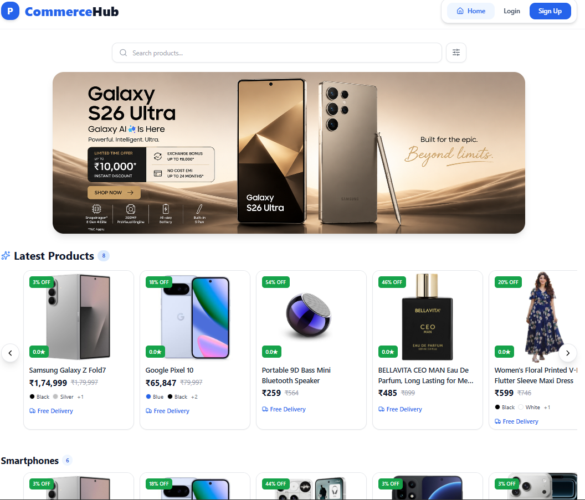
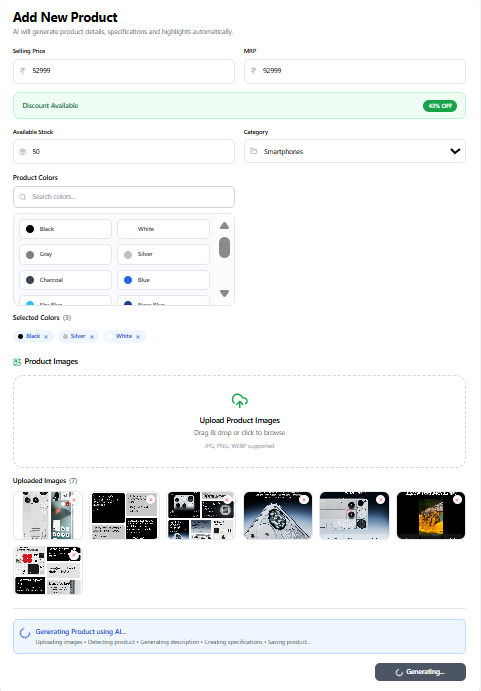
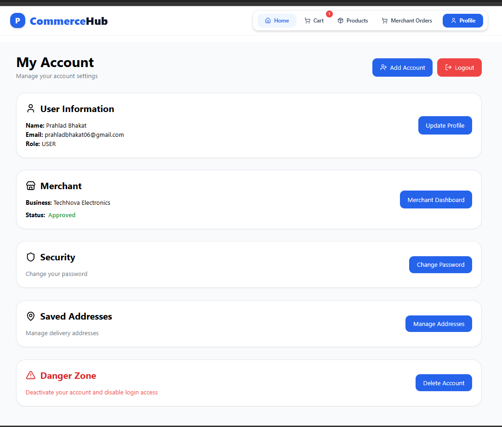
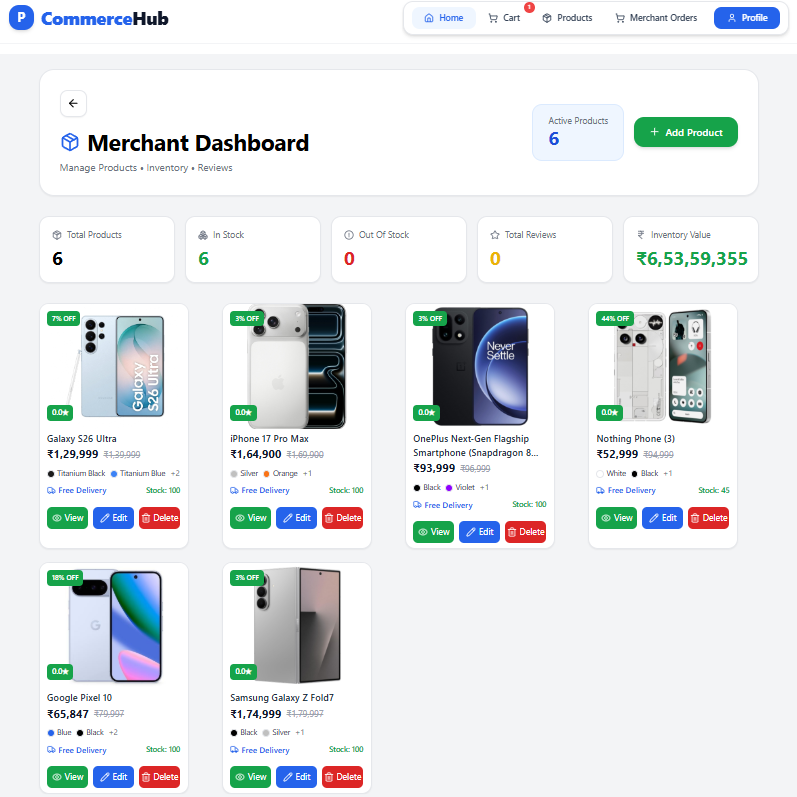
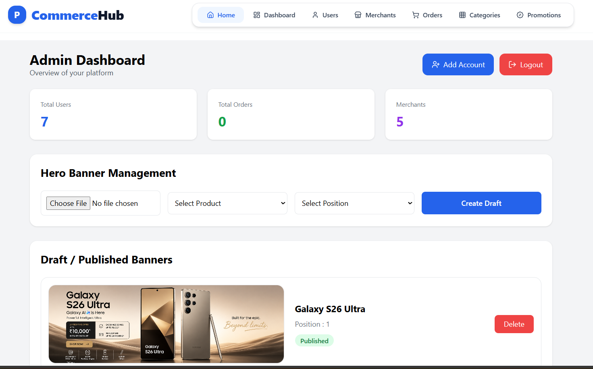

<div align="center">

# 🎨 CommerceHub Frontend

### Modern React Frontend for an AI-Powered Multi-Role E-Commerce Platform

A responsive and production-inspired e-commerce frontend built with **React**, **Vite**, **Tailwind CSS**, **React Router**, and **Axios**, designed to work seamlessly with the CommerceHub Spring Boot Backend.

<p align="center">


</p>

</div>

---

# 📖 Overview

CommerceHub Frontend is a modern React application that provides a complete shopping experience for **Users**, **Merchants**, and **Administrators**.

The frontend communicates with the Spring Boot backend through REST APIs and offers a responsive, clean, and user-friendly interface for managing products, orders, authentication, AI-powered product creation, and administrative operations.

---

# ✨ Key Features

### 👤 User

- Secure Authentication
- Product Browsing
- Advanced Search & Filters
- Shopping Cart
- Checkout
- Order Tracking
- Product Reviews
- Profile & Address Management

### 🛍 Merchant

- AI Product Creation
- Product Management
- Image Upload
- Inventory Management
- Merchant Dashboard

### 👨‍💼 Admin

- Category Management
- Hero Banner Management
- Platform Monitoring
- Order Management

---

# 🎨 UI Highlights

- Responsive Design
- Modern Product Cards
- Horizontal Category Sections
- Hero Banner Carousel
- Search & Filtering
- Pagination
- Loading States
- Toast Notifications
- Clean Dashboard Layout
- Mobile-Friendly Navigation

---

# 🛠 Tech Stack

| Category | Technology |
|----------|------------|
| Framework | React 19 |
| Build Tool | Vite |
| Styling | Tailwind CSS |
| Routing | React Router DOM |
| API Client | Axios |
| Icons | Lucide React |
| Notifications | React Toastify |

---

# 📸 Screenshots

### 🏠 Home Page



---

### 🤖 AI Product Generation



---

### 👨‍💼 Admin Dashboard



---

### 🛍 Merchant Dashboard



---

### 👨‍💼 Admin Dashboard



---

# 📂 Project Structure

```text
frontend
│
├── public
├── src
│   ├── assets
│   ├── components
│   ├── layouts
│   ├── pages
│   │   ├── admin
│   │   ├── auth
│   │   ├── merchant
│   │   └── user
│   ├── services
│   ├── App.jsx
│   └── main.jsx
│
├── package.json
├── vite.config.js
└── README.md
```
---

# 🏗 Frontend Architecture

CommerceHub Frontend follows a modular React architecture where components, pages, services, and layouts are organized independently. This structure improves code reusability, maintainability, and scalability.

---

# ⚛ Application Structure

The application is divided into multiple reusable modules.

```text
src
│
├── assets
├── components
├── layouts
├── pages
├── services
├── App.jsx
└── main.jsx
```

Each folder has a dedicated responsibility, making the codebase easier to maintain as new features are added.

---

# 📄 Pages

Pages are organized according to user roles.

### 👤 User

- Home
- Products
- Product Details
- Cart
- Checkout
- Orders
- Profile

### 🛍 Merchant

- Dashboard
- Products
- Add Product
- Edit Product
- Orders

### 👨‍💼 Admin

- Dashboard
- Categories
- Hero Banner
- Products
- Orders

### 🔐 Authentication

- Login
- Register
- Forgot Password

---

# 🧩 Reusable Components

The UI is built using reusable React components.

Major components include:

- Navbar
- Footer
- Hero Banner
- Product Card
- Category Section
- Search Bar
- Filters
- Pagination
- Loading Spinner
- Empty State
- Modal Components

Using reusable components reduces duplicate code and keeps the interface consistent.

---

# 🧭 Routing

Navigation is handled using **React Router DOM**.

Routing provides:

- Public Routes
- Protected Routes
- Role-Based Navigation
- Dynamic URL Parameters
- Nested Layouts

This ensures users only access pages relevant to their role.

---

# 🔄 API Integration

Frontend communicates with the backend using **Axios**.

Responsibilities include:

- Authentication Requests
- Product APIs
- Category APIs
- Cart APIs
- Order APIs
- Review APIs
- Merchant APIs
- Admin APIs

All API calls are managed from the **services** layer, keeping components clean and focused on UI rendering.

---

# 📊 State Management

The application primarily uses React Hooks for state management.

Common hooks include:

- useState
- useEffect
- useRef
- useNavigate
- useParams

Local component state is used for forms, UI interactions, filters, and API responses, keeping the architecture lightweight.

---

# 🔄 Frontend Workflow

Every user action follows a simple execution flow.

```text
User Action
     │
     ▼
React Component
     │
     ▼
Axios API Request
     │
     ▼
Spring Boot Backend
     │
     ▼
JSON Response
     │
     ▼
React State Update
     │
     ▼
UI Re-render
```

This predictable flow keeps the application responsive and easy to debug.

---

# 🎯 Frontend Highlights

CommerceHub Frontend provides:

- Responsive Layout
- Modular Architecture
- Reusable Components
- Role-Based Navigation
- REST API Integration
- Dynamic Product Rendering
- Optimized User Experience
- Clean & Modern UI

These design principles ensure the frontend remains scalable, maintainable, and easy to extend as new features are introduced.

---

# 🚀 Getting Started

## Prerequisites

Before running the project, ensure the following are installed:

- Node.js (v18+)
- npm
- Git
- Backend API (CommerceHub Backend)

---

# ⚙ Environment Variables

Create a `.env` file in the project root.

```env
VITE_API_BASE_URL=http://localhost:8080/api
```

For production:

```env
VITE_API_BASE_URL=https://ecommerce-backend-o9vh.onrender.com/api
```

---

# ▶ Run Locally

Clone the repository

```bash
git clone https://github.com/PRAHLAD09-dev/springboot-react-ecommerce-project.git
```

Move to frontend

```bash
cd frontend
```

Install dependencies

```bash
npm install
```

Start development server

```bash
npm run dev
```

Application URL

```text
http://localhost:5173
```

---

# 📦 Production Build

Generate an optimized production build.

```bash
npm run build
```

Preview production build locally.

```bash
npm run preview
```

---

# ☁ Deployment

The frontend is deployment-ready and can be hosted on:

- Vercel
- Netlify
- GitHub Pages
- Firebase Hosting

Recommended Deployment:

| Service | Purpose |
|----------|----------|
| Vercel | Frontend Hosting |
| Render | Backend Hosting |
| Neon | PostgreSQL Database |
| Cloudinary | Image Storage |

---

# 📈 Future Improvements

Planned features include:

- Dark Mode
- Wishlist
- Product Comparison
- AI Search
- PWA Support
- Multi-language Support
- Real-time Notifications
- Performance Optimization

---

# 🤝 Contributing

Contributions are welcome.

1. Fork the repository
2. Create a feature branch
3. Commit your changes
4. Open a Pull Request

Please follow the existing project structure and coding standards.

---

# 👨‍💻 Author

**Prahlad Bhakat**

Full Stack Developer

### Tech Stack

- Java
- Spring Boot
- React
- PostgreSQL

GitHub

```text
https://github.com/PRAHLAD09-dev
```

---

# 📜 License

This project is created for **learning, portfolio, and educational purposes**.

Feel free to explore the codebase, learn from it, and use it as a reference for your own projects.

---

<div align="center">

## ⭐ If you like this project, consider giving it a Star ⭐

**Built with ❤️ using React, Vite, Tailwind CSS & Spring Boot**

</div>
